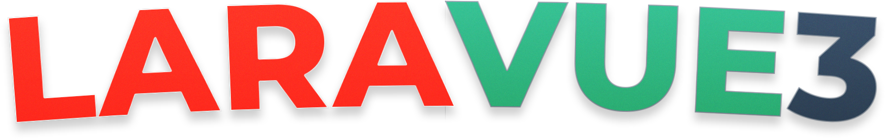

<!-- 

 -->

## A project template featuring Laravel, Vue 3, and TailwindCSS

For all the tinkerers who just want to code, get your next project up and running in a flash with this preconfigured Laravel + Vue + TailwindCSS stack. Just clone and start building!

## Installation
Getting started is super simple. Just run the following commands.

    git clone https://github.com/projectrebel/laravue3.git
    cd laravue3
    composer install
    npm install && npm run watch

## License

The Laravue3 is open-sourced software licensed under the [MIT license](https://opensource.org/licenses/MIT).
